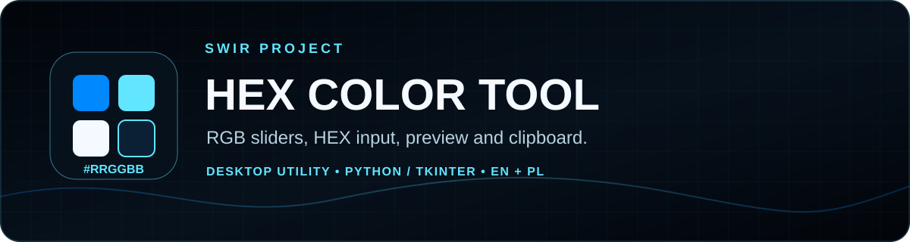
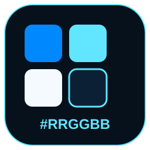

<!-- SWIR-README-STANDARD:v2 -->

<div align="center">



# HEX Color Tool

**Create, preview and copy RGB / HEX colors from a small bilingual Tkinter desktop app.**


[](https://github.com/Swir)
[](https://github.com/Swir/Hex-kolor/releases/tag/hex)
[](https://github.com/Swir/Hex-kolor/stargazers)

[**Highlights**](#-highlights) · [**Quick Start**](#-quick-start) · [**Usage**](#-usage) · [**Releases**](#-releases)

</div>

<p align="center">
  
</p>

**Product roadmap progress:** N/A — this repository does not contain a canonical checklist or weighted roadmap from which a truthful completion percentage can be reproduced.

## 📍 Project Status

| Item | Current state |
|---|---|
| Project type | Small desktop color utility |
| Source interfaces | Separate English and Polish Tkinter scripts |
| Public package | Existing Windows archive in the `hex` release, named **Hex color v1.10** |
| Source UI title | The current scripts identify themselves as version 1.0 |
| Product roadmap | Not present; completion percentage is intentionally N/A |

<p align="center">
  
</p>

The release label and the source-window title are historical facts from different artifacts; this documentation does not rewrite either version.

## 🚀 Overview

**HEX Color Tool** is a local Python/Tkinter utility for choosing colors with RGB sliders, entering a six-digit HEX code, opening the system color chooser, previewing the selected color and copying its normalized `#RRGGBB` value to the clipboard.

The repository contains two equivalent user-facing scripts: [`Hex kolor English.py`](Hex%20kolor%20English.py) for English and [`hex_kolor.py`](hex_kolor.py) for Polish. No network service is used by the application source.

## ✨ Highlights

| Feature | What it does |
|---|---|
| 🎚️ RGB sliders | Select red, green and blue values from 0 through 255. |
| #️⃣ RGB → HEX | Format the current RGB components as uppercase `#RRGGBB`. |
| ✍️ Manual HEX | Accept a seven-character `#RRGGBB` value after basic validation. |
| 🎨 System picker | Open Tkinter's native `colorchooser` dialog and map the chosen color back to the sliders. |
| 👁️ Live preview | Update a local preview area with the selected color. |
| 📋 Clipboard | Copy the current normalized HEX value to the desktop clipboard. |
| 🌍 EN / PL | Choose the English or Polish source script; both implement the same workflow. |

## ⚙️ Quick Start

### Existing Windows archive

An older packaged English build is available in the [`hex` release](https://github.com/Swir/Hex-kolor/releases/tag/hex) as `Hex.kolor.English-windows.zip`. The GitHub release is named **Hex color v1.10** and was published on January 26, 2024. This documentation migration did not rebuild or runtime-test that historical archive.

### From source

Use Python 3 with working Tkinter support. Tkinter is part of many standard Python desktop installations and is supplied by the OS/Python distribution rather than installed from PyPI.

```bash
git clone https://github.com/Swir/Hex-kolor.git
cd Hex-kolor
python -m tkinter
```

Close the Tkinter test window, then launch one language version:

```bash
python "Hex kolor English.py"
```

or:

```bash
python hex_kolor.py
```

> **Dependency note:** the legacy [`requirements.txt`](requirements.txt) contains only `tkinter`. Do not rely on `pip install -r requirements.txt`; install/use a Python distribution with Tkinter available instead.

## 📋 Requirements / Compatibility

- Python 3 with Tkinter for source use.
- A graphical desktop session and clipboard support.
- The repository contains a historical Windows archive; no current packaged Linux or macOS build is published here.
- No third-party Python import is used by either current source script.

## 🎮 Usage

1. Move the **Red / Green / Blue** sliders and choose **Update color**, or open **Choose color**.
2. To enter a value manually, use the full `#RRGGBB` form, for example `#62E5FF`, then choose the manual update action.
3. Confirm the preview and displayed code.
4. Use **Copy color code** to put the normalized current value on the clipboard.

Invalid manual values are ignored by the current source; there is no error dialog for malformed HEX input.

## 🧠 Technology / Project Layout

| Path | Role |
|---|---|
| [`Hex kolor English.py`](Hex%20kolor%20English.py) | English Tkinter application. |
| [`hex_kolor.py`](hex_kolor.py) | Polish Tkinter application. |
| [`requirements.txt`](requirements.txt) | Legacy Tkinter note; not a usable PyPI dependency list. |
| [`assets/readme/`](assets/readme/) | SWIR README PRO v2 branding and Progress SVG PRO assets. |
| [`tools/generate_readme_progress.py`](tools/generate_readme_progress.py) | Deterministically regenerates/checks the N/A progress graphics. |

The two application scripts duplicate the same small implementation rather than sharing a translation layer. This README migration does not refactor application behavior.

## 📦 Releases

- [**Hex color v1.10 (`hex`) →**](https://github.com/Swir/Hex-kolor/releases/tag/hex)
- [**All releases →**](https://github.com/Swir/Hex-kolor/releases)

The existing release provides one English Windows ZIP. No new version, tag or binary was created by this documentation migration.

## ⚠️ Limitations

- There is no canonical product roadmap, so software-completion progress is **N/A** rather than estimated.
- Manual HEX input accepts only the exact seven-character `#RRGGBB` form; shorthand such as `#FFF` is not supported.
- Invalid manual input is silently ignored.
- English and Polish are maintained as separate source files.
- No `LICENSE` file is present in the current repository; this migration does not assign a license.

## 🔎 Search Keywords

`rgb to hex converter` • `hex color picker` • `python color picker` • `tkinter color tool` • `hex code generator` • `desktop color picker` • `rgb color converter` • `web design color tool` • `python tkinter utility` • `hex clipboard tool` • `bilingual color picker` • `RRGGBB color preview`

---

<div align="center">



### `PICK • PREVIEW • COPY`

**HEX Color Tool — by Swir**

[**← SWIR profile**](https://github.com/Swir) · [**All projects →**](https://github.com/Swir?tab=repositories) · [**Report an issue**](https://github.com/Swir/Hex-kolor/issues)

</div>
